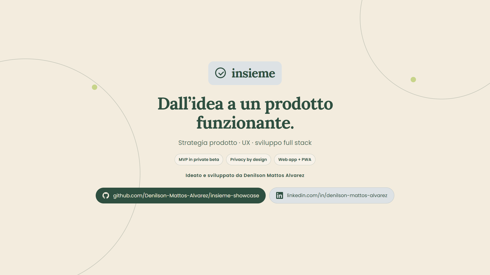

# Insieme

**A privacy-conscious product that turns personal intentions into shared, measurable progress.**

## Video demo

[▶ Watch the Executive Demo in Italian](./Insieme_Executive_Demo_IT_v5.mp4)

The demo is presented in Italian with embedded captions. It contains product mock-ups and does not expose the private-beta URL, credentials, source code, or user data.

## The product idea

Starting a habit is often easier than sustaining it. Insieme explores a calmer form of accountability: small groups built around compatible goals, rhythms, and availability, without rankings or social pressure.

The product moves beyond simple matching. It helps people turn an intention into a visible commitment through planning, check-ins, shared progress, recovery flows, and short tasks with clear ownership.

## What the MVP demonstrates

- Personal habit and goal setup
- Intentional matching based on compatibility
- Small accountability groups
- Scheduled sessions and daily check-ins
- Shared progress and non-judgmental recovery flows
- Collective paths with phases, tasks, owners, and verifiable outcomes
- Administrative monitoring and group support
- A responsive web app and installable PWA experience

## Product principles

- **Small steps:** consistency matters more than perfection
- **Human support:** groups remain intentionally small
- **Privacy by design:** no production environment or user data is exposed here
- **Calm interaction:** no rankings, public pressure, or addictive mechanics
- **Measurable progress:** commitments and outcomes remain visible to the group

## Technology

Next.js · React · TypeScript · Supabase · PostgreSQL · PWA · Vercel

## Project status

Insieme is an independently developed MVP currently in private beta. This public repository is a product showcase; the production source code, database, configuration, and private environment are intentionally not published.

Designed and developed by [Denilson Mattos Alvarez](https://www.linkedin.com/in/denilson-mattos-alvarez).
